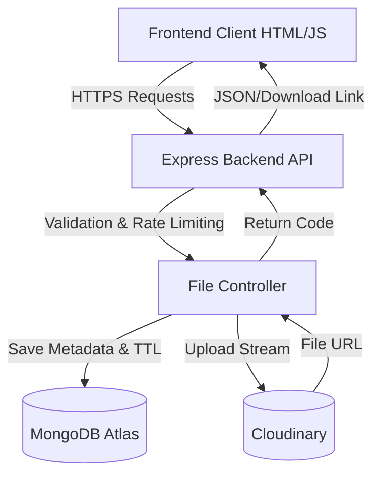

# DropIn - Modern Secure File Transfer

A robust, secure file transfer application built with a separate Node.js backend (Express + MongoDB) and an HTML/JS/CSS frontend. It allows users to upload files and share them via secure nano-ID codes or QR codes.

## Features & Technical Upgrades

- **Real Persistence**: Uses MongoDB Atlas with TTL indices for automatic expiry.
- **Robust Storage**: Integrates with Cloudinary for fast and reliable cloud file storage.
- **Improved Security**: Rate limiting, MongoDB sanitization, password protection, and Helmet protection.
- **Cryptographically Secure IDs**: Utilizes high-entropy `nanoid` (8 characters) for brute-force resistance.
- **Parallel Processing**: High-speed parallel file uploads to Cloudinary for massive performance gains.
- **Live Progress UI**: Real-time progress bar for both browser upload and server-side processing.
- **Flexible Management**: Users can delete transfers instantly or extend the expiry time.

---

## Architecture Diagram



---

## Comprehensive Security Notes

1. **Anti-Brute Force**: Transfer codes are 8-character high-entropy strings generated using `nanoid`.
2. **Rate Limiting**: IP-based rate limiting via `express-rate-limit` (max 50 requests per minute).
3. **Data Sanitization**: All inputs are sanitized using `express-mongo-sanitize` to prevent NoSQL injection.
4. **Automated Expiry**: A MongoDB TTL index automatically wipes the document upon hitting `expiresAt`.
5. **Secure Headers**: `helmet` manages HTTP headers, blocking common vulnerabilities.
6. **Robust Validation**: Files are strictly verified against size and type constraints.
7. **Password Protection**: Optional end-to-end password requirement for access.

---

## Deployment Strategy

### Frontend Deployment (Vercel)
The frontend is a static SPA. It can be easily deployed to Vercel.
Ensure your `vercel.json` includes SPA rewrites:
```json
{
  "rewrites": [{ "source": "/(.*)", "destination": "/" }]
}
```

### Backend Deployment (Render / Railway)
The backend should be deployed to a Node.js environment like Render or Railway. Make sure to define these environment variables in your production environment:

- `PORT` (e.g., 3001)
- `MONGO_URI` (MongoDB Atlas Connection String)
- `CLOUDINARY_CLOUD_NAME`
- `CLOUDINARY_API_KEY`
- `CLOUDINARY_API_SECRET`

**Render Note**: Ensure you set the Node version natively using the `engines` property or Render's configuration. Run `npm install` and the start command is `npm start`.

---

## API Documentation

### 1. Upload Files
- **POST** `/api/upload`
- **Body**: `multipart/form-data` with multiple `files` (Max 100MB per file) and optional `password`.
- **Description**: Uploads files to Cloudinary in parallel, creates a MongoDB entry, and returns a secure transfer code.

### 2. Get Transfer Info
- **GET** `/api/info/:code`
- **Description**: Retrieves metadata for the transfer (files, expiry, password requirement). Pass `?password=...` for protected transfers.

### 3. Download Files (Archive)
- **GET** `/api/download/:code`
- **Description**: Generates a ZIP archive of all files in the transfer. Increments the global download counter. Pass `?password=...` for protected transfers.

### 4. Delete Transfer
- **DELETE** `/api/transfers/:code`
- **Description**: Deletes the Cloudinary files and the MongoDB record instantly.

### 5. Extend Expiry
- **PUT** `/api/transfers/:code/extend`
- **Description**: Extends existing expiry length by an additional 24 hours.

---

## Scaling Discussion

As the application payload grows, consider the following scaling strategies:
1. **Direct-to-Cloud Uploads**: Bypassing the backend by generating Cloudinary signed URLs. The client directly uploads to Cloudinary, reducing backend load drastically.
2. **CDN Delivery**: While Cloudinary acts natively as CDN, placing Cloudflare in front of the application can handle massive traffic spikes.
3. **Database Sharding**: Over long periods, though TTL automatically cleans documents, a high read/write volume metadata database (MongoDB) should utilize connection pooling properly or enable sharding.
4. **Microservices (Optional)**: Move upload processing to an async worker service utilizing a queue (e.g., bullmq / Redis) if heavy file compression or transformations are needed offline.

---

## Local Setup

1. Clone repo and create an `.env` in `backend` based on `.env.example`.
2. Backend: `cd backend` -> `npm install` -> `npm run dev`.
3. Frontend: Host via local tools like `npx serve .` inside `frontend`.

## Testing
Run Jest API tests in the backend using:
```bash
cd backend
npm test
```
